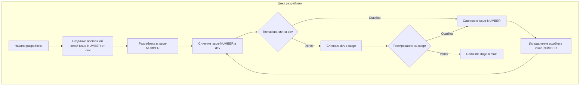
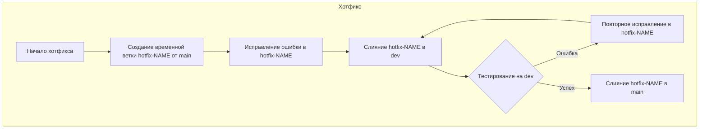

# Simple Project

## Разработка

### Репозиторий
Ссылка: https://github.com/MakarovS96/sf_pract_2

### IDE
Для разработки используется [Visual Studio Code](https://code.visualstudio.com/download)
Для загрузки актуальных расширений для проекта импортируйте профиль `py_proj.code-profile`

### Запуск

#### Локально

Сначала нужно клонировать репозиторий локально
```bash
git clone https://github.com/MakarovS96/sf_pract_2
```

Затем устанавливаем и запускаем virtual environment
```bash
python3 -m venv venv
source ./venv/bin/activate
```

Устанавливаем зависимости проекта
```bash
pip3 install -r requirements.txt
```

Запускаем проект локально в тестовом окружении
```bash
flask --app main --debug run
```
Чтобы завершить выполнение жмем <kbd>Ctrl</kbd>+<kbd>C</kbd> в открытом терминале

Чтобы выйти из venv
``` bash
deactivate
```

#### Dev Container
Используйте функционал Visual Studio Code для работы с Dev Container

### Цикл разработки

#### Правила именования веток

##### Основные ветки:

- **dev** - основная ветка для разработки и интеграции новых изменений.
- **stage** - ветка для предрелизного тестирования.
- **main** - ветка, содержащая код, готовый для выпуска в продакшн.

##### Временные ветки:

###### Ветки для разработки фич или исправления багов:
`issue-<issue-number>`: используется для разработки новых фич или исправления багов. `<issue-number>` - это уникальный номер задачи или баг-репорта.

Пример: `issue-1234`

###### Ветки для хотфиксов:
`hotfix-<short-description>`: используется для создания срочных исправлений, которые должны быть быстро внедрены в продакшн. `<short-description>` - это краткое описание исправляемой проблемы.

Пример: `hotfix-fix-login-error`

#### Правила именования для коммитов

Для консистентности и облегчения работы с историей коммитов, также рекомендуется соблюдать следующие правила именования коммитов:

##### Формат коммитов:
- `[<type>] <description> (#<issue-number>)`
- `<type>` - тип коммита (например, **feat** для новой фичи, **fix** для исправления бага).
- `<description>` - краткое описание изменений.
- `<issue-number>` - номер задачи или баг-репорта, связанного с коммитом.

Пример: `[feat] Добавлен новый функционал авторизации (#1234)`

#### Разработка



1. **Начало разработки:** Создание временной ветки `issue-NUMBER` от `dev` для новой задачи.
2. **Разработка в `issue-NUMBER`:** После завершения разработки код сливается в ветку `dev`.
3. **Тестирование на `dev`:**
    - В случае ошибки код из `dev` сливается обратно в `issue-NUMBER` для исправления.
    - В случае успеха код сливается в ветку `stage`.
4. **Тестирование на `stage`:**
    - В случае ошибки код из stage сливается обратно в `issue-NUMBER` для исправления.
    - В случае успеха код сливается в ветку `main`.

#### Хотфиксы:



1. Создается временная ветка `hotfix-NAME` от `main` для исправления критической ошибки.
2. После исправления ошибка тестируется на ветке `dev`.
    - Если тест не успешен, дорабатываем изменения в `hotfix-NAME`
    - Если тест успешен, хотфикс сливается обратно в `main`.

### Работа с git

#### Создание ветки

1. Обновите локальную копию основной ветки `dev`:
    ```bash
    git checkout dev
    git pull origin dev
    ```

2. Создайте новую ветку от `dev` для своей задачи:
    ```bash
    git checkout -b issue-<issue-number>
    ```
    Пример:
    ```bash
    git checkout -b issue-1234
    ```

#### Внесение изменений

1. Внесите необходимые изменения в код

2. Добавьте измененные файлы в индекс:
    ```bash
    git add .
    ```

3. Создайте коммит с изменениями:
    ```bash
    git commit -m "[fix/feat] Краткое описание изменений (#<issue-number>)"
    ```
    Пример:
    ```bash
    git commit -m "[feat] Добавлен новый функционал авторизации (#1234)"
    ```

4. Отправьте свою ветку в удаленный репозиторий:
    ```bash
    git push origin issue-<issue-number>
    ```
    Пример:
    ```bash
    git push origin issue-1234
    ```

#### Слияние изменений с основной кодовой базой


1. Сделате **Pull Request (PR)** из ветки `issue-<issue-number>` в `dev`

2. Разрешите возможные конфликты

#### Дополнительные шаги для проверки и тестирования

После слияния изменений в `dev` рекомендуется выполнить следующие шаги для проверки:

1. Проверьте функциональность изменений в тестовой среде.

2. Создайте **Pull Request (PR)** из ветки `dev` в `stage` для проведения кода в предрелизное тестирование.

